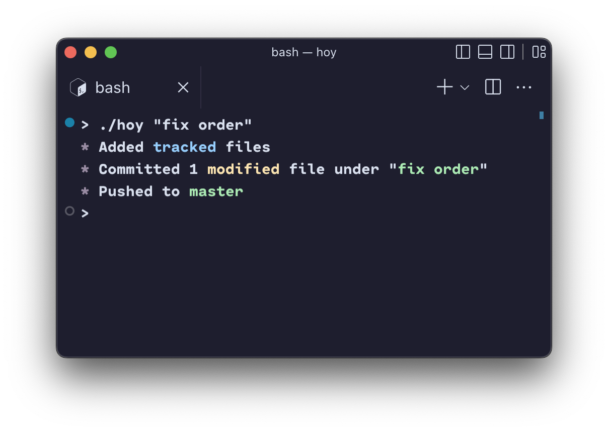

<h3 align="center"> (A)hoy!</h3>

<p align="center">

Convenient wrapper for the *`git add, commit, push`* sequence.

Written for Node with Google's [zx](https://github.com/google/zx) scripting library.



</p>

---

#### Usage

```sh
hoy "commit message" [-f] [-a]
```

Hoy **will respect your current branch**

`-a` add all files, `-f` force push to remote.

Run Hoy anywhere you would run Git.

---

#### Requirements

Node version >= 16.0.0 and [zx](https://github.com/google/zx) installed with `npm i -g zx`
